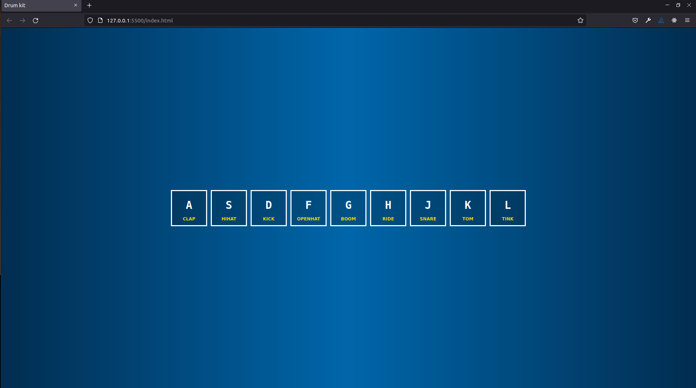

[![Forks][forks-shield]][forks-url]
[![Stargazers][stars-shield]][stars-url]
[![Issues][issues-shield]][issues-url]
[![MIT License][license-shield]][license-url]
[![LinkedIn][linkedin-shield]][linkedin-url]

# JavaScript: Drum Kit

> Drum kit is the online entertaning app for drum lovers

The drum kit is an app where you can play the drums with either keyboard or mouse by clicking the keys.

## Built With

- Major languages: HTML/CSS, JavaScript

## Getting Started

To get a local copy up and running follow these simple example steps.

### Prerequisites

Install or update on your local terminal the node.js package.

### Setup

To get a local copy up and running follow these simple steps.

To setup the Stock Market project in your local, in the repo page:
click on code (dropdown list) > Download as ZIP;
or open terminal of path you want to install project and run this command  
`git@github.com:git@github.com:Hope1226/drum-kit.git`

### Install

Run in your terminal the following commands:

**`$ cd drum-kit/'`** 
**`$ code .`** 
**`$ go live server`** 

## Show your support

Give a ⭐️ if you like this project!

## Acknowledgments

This web-app is built within the online tutorials provided by Wes Bos. 

## 📝 License

This project is [MIT](./MIT.md) licensed.
